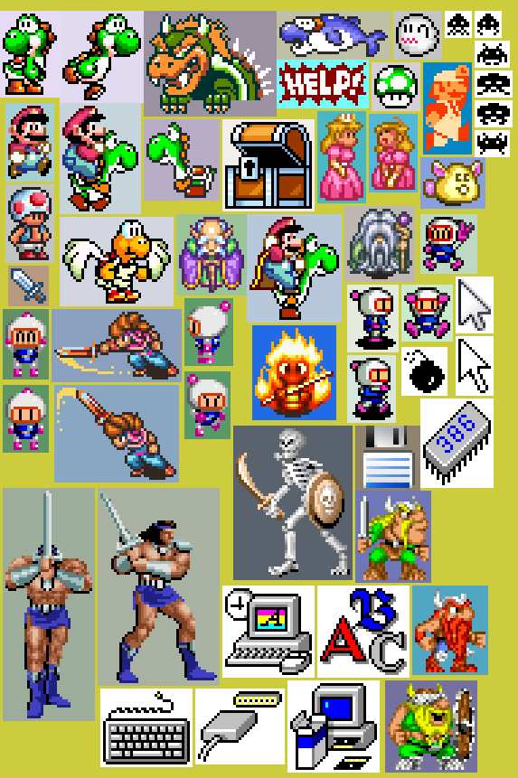
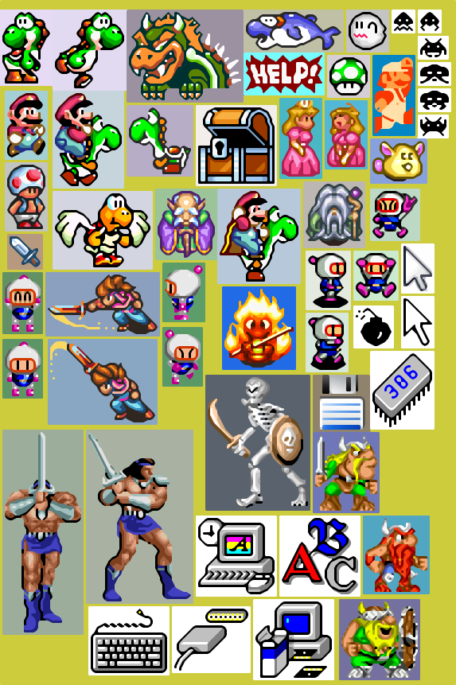
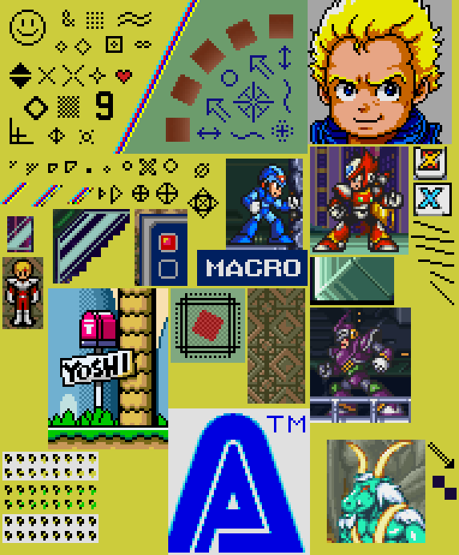
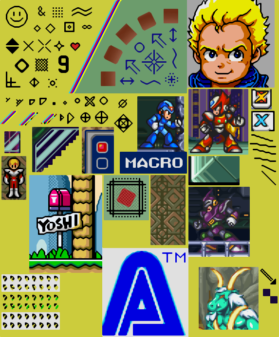

# xbrz

[GitHub] | [NPM] | [API Doc]

This project is a TypeScript port of the [C++ implementation](https://sourceforge.net/projects/xbrz/) of the xBRZ pixel scaling algorithm, originally created by Zenju. The low-level xBRZ part is a WASM module written in [AssemblyScript](https://www.assemblyscript.org/).

This library works in Node.js and browsers. The binary WASM module is embedded in JavaScript (16 KiB), so you don't need to care about how the browser finds the WASM file.

The performance is pretty much the same as the original C++ implementation.


## Usage

Install the library as a dependency in your project:

```
npm install @kayahr/xbrz
```

And then use it like this:

```typescript
import { Scaler } from "@kayahr/xbrz";

// Create a scaler for a given source image size and scale factor
const scaler = new Scaler(96, 84, 3);

// Scale the image. Source and target are RGBA pixel
// data in a Uint8ClampedArray (like `ImageData#data`)
const target = scaler.scale(source);

// The configured source and target sizes and the
// scale factor can be read from the scaler if needed:
console.log(`Source size: ${scaler.sourceWidth} x ${scaler.sourceHeight}`);
console.log(`Scale factor: ${scaler.factor}`);
console.log(`Target size: ${scaler.targetWidth} x ${scaler.targetHeight}`);
```

Note that each scaler uses a separate WASM module instance with memory created and initialized for the given source size, scale factor, and LUT mode. Each WASM module instance creates and caches a Y'CbCr lookup table for better performance. By default, this uses a 5-bit lookup table (~128 KiB), matching the Rust port. You can opt into the larger 8-bit lookup table (~64 MiB) by setting the `largeLut` option to `true`:

```typescript
const preciseScaler = new Scaler(96, 84, 3, { largeLut: true });
```

If you do lots of scaling operations with the same settings, it is highly recommended to reuse the scaler instance, especially when you use the large LUT because creating the lookup table takes time and allocates additional memory per scaler.

Also note that a scaler reuses the target array returned by the `scale` method. So when you use the same scaler to scale multiple images, process the returned target array immediately or create a copy so the content is not overwritten by the next scaling operation.

WASM memory is automatically freed when the scaler is garbage-collected.


## Example images

Also see the [images](https://github.com/kayahr/xbrz/tree/main/src/test/images) directory for examples at more scaling factors. Most of these images were taken from the [Rust port](https://github.com/bell345/xbrz-rs) of xBRZ and are used here for unit testing and comparison purposes.

### Sample 1

<table>
  <tr>
    <th style="text-align: center">Nearest Neighbor x3</th>
    <th style="text-align: center">xBRZ x3</th>
  </tr>
  <tr>
    <td width="50%"></td>
    <td width="50%"></td>
  </tr>
</table>

### Sample 2

<table>
  <tr>
    <th style="text-align: center">Nearest Neighbor x3</th>
    <th style="text-align: center">xBRZ x3</th>
  </tr>
  <tr>
    <td width="50%"></td>
    <td width="50%"></td>
  </tr>
</table>

### Yoshi

<table>
  <tr>
    <th style="text-align: center">Nearest Neighbor x6</th>
    <th style="text-align: center">xBRZ x6</th>
    <th style="text-align: center">Nearest Neighbor x6 (Transparent)</th>
    <th style="text-align: center">xBRZ x6 (Transparent)</th>
  </tr>
  <tr>
    <td style="width: 25%; text-align: center"></td>
    <td style="width: 25%; text-align: center"></td>
    <td style="width: 25%; text-align: center"></td>
    <td style="width: 25%; text-align: center"></td>
  </tr>
</table>

[API Doc]: https://kayahr.github.io/xbrz/
[GitHub]: https://github.com/kayahr/xbrz
[NPM]: https://www.npmjs.com/package/@kayahr/xbrz
